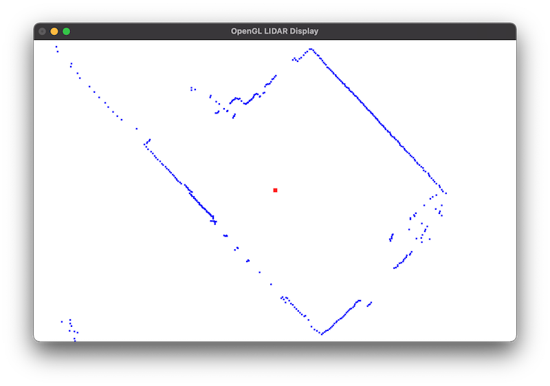
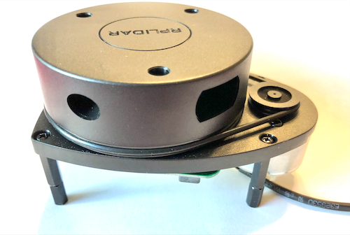

# OpenGL-LIDAR-Display

[](https://travis-ci.com/jasonacox/OpenGL-LIDAR-Display)

## Description
This project provides a realtime OpenGL based display for LIDAR point cloud imaging. It is based on the [Slamtec  RPLIDAR A1 device](https://www.slamtec.com/en/Lidar/A1).



Requires: OpenGL, GLUT and the Slamtec RPLIDAR SDK. MacOS is the target platform but it should be easy to port to any OpenGL platform (Linux, RPi, Windows).

## Get Started
To build this project, follow the steps below.  If you are on macOS, you can jump to step 2 below.

### Step 1 - Build RPLIDAR SDK
You can run the `build.sh` script included to download and build the SDK for RPLIDAR. This will copy the new headers and libraries into the ./lib and ./include folders.

### Step 2 - Build the lidar binary
The `lidar` binary is built by using the included Makefile.  If you are not using a Mac or have a different UART serial port you want to use, edit the [lidar.cpp](lidar.cpp) code to update the PORT value in Settings.  Depending upon your applications, you can also adjust the SCALE, windows SCREEN size and window location START points.

```cpp
// Settings 
#define PORT "/dev/tty.SLAB_USBtoUART"   // macOS UART for RPLIDAR
#define SCALE 0.1   // Distance scale for screen
#define SCREENX 500 // Size of Display window
#define SCREENY 500 
#define STARTX 100  // Coordinates to place window
#define STARTY 100
```

To build, run make:

```bash
make
```

### Step 3 - Run the Display
Plug in your RPLIDAR A1 device and run the `lidar` executable.  Use Ctrl-C to stop.

```
$ ./bin/lidar               
LIDAR OpenGL Display for Slamtec RPLIDAR Device
Using RPLIDAR SDK Version: 1.12.0
Setting serial port baudrate...
Connected via /dev/tty.SLAB_USBtoUART at 115200 baud
RPLIDAR S/N: CC8F9A86C0E09CC7A2E09DF75E5D3077
Firmware Ver: 1.28
Hardware Rev: 5
RPLidar health status : 0
Launching OpenGL Window
^C Received - Stopping - Shutting down LIDAR

$
```

## Device 

This project uses the Slamtec RPLIDAR A1M8 LIDAR Sensor.  It provides a 2D 360 degree, 12m scanning radius and is useful for obstacle avoidance and navigation for robots.



* Measurement frequency up to 8000 times/s
* Weight: 0.37kg
* Size: 13cm x 10cm x 8cm 
* Range: 0.15 - 6m
* Resolution: < 0.5mm @ ≤ 1 Degree
* Technology: OPTMAG wireless power and optical communication 
* Links: [Slamtec](https://www.slamtec.com/en/Lidar/A1) [Amazon](https://www.amazon.com/Slamtec-RPLIDAR-Scanning-Avoidance-Navigation/dp/B07TJW5SXF)


### Device Setup

The device requires the Silicon Labs CP210x USB to UART Bridge Virtual COM Port (VCP) driver.  See [here](https://www.silabs.com/developers/usb-to-uart-bridge-vcp-drivers) for downloading this driver if you do not have it already installed.

